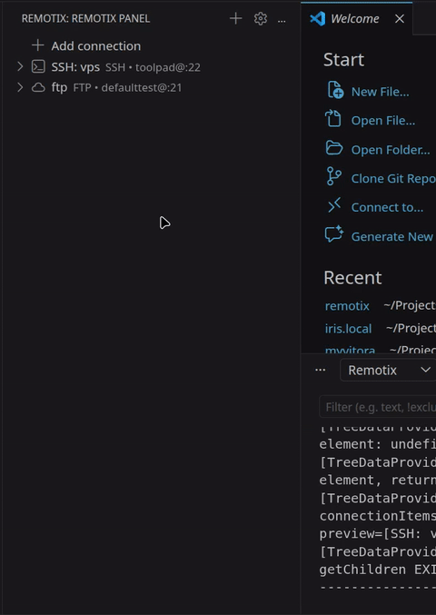
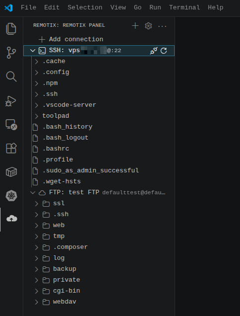
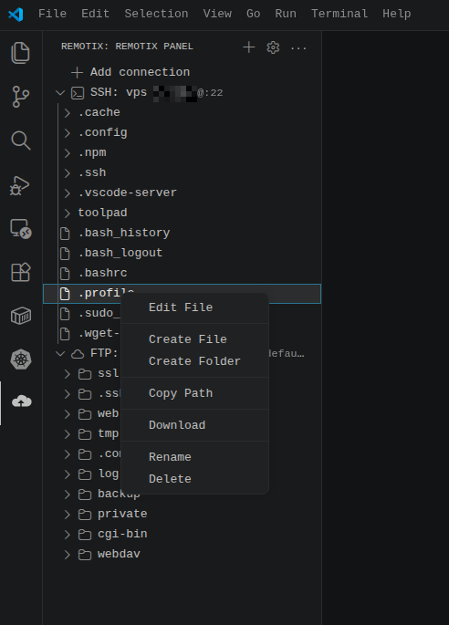
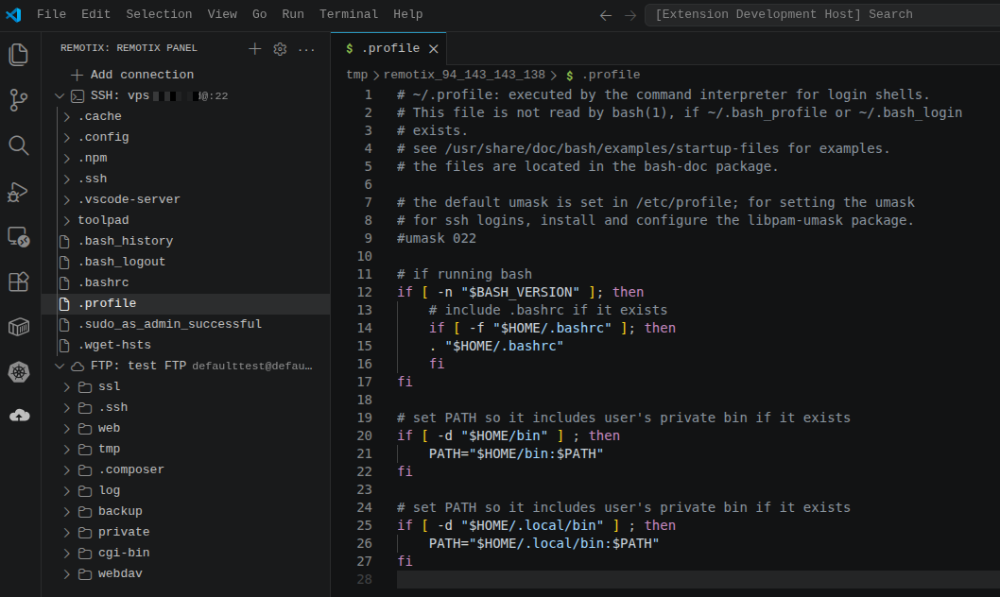
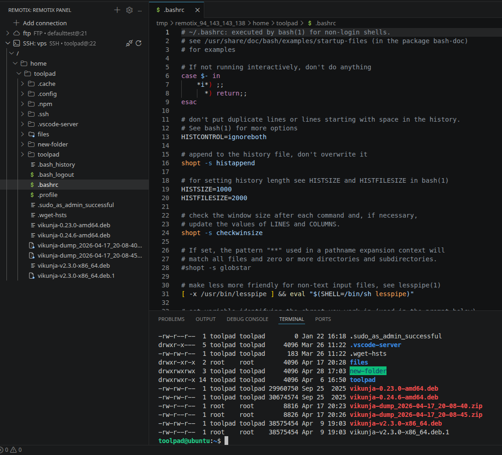
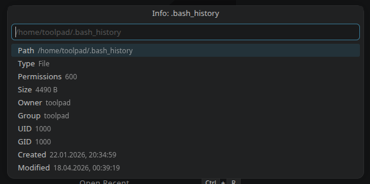
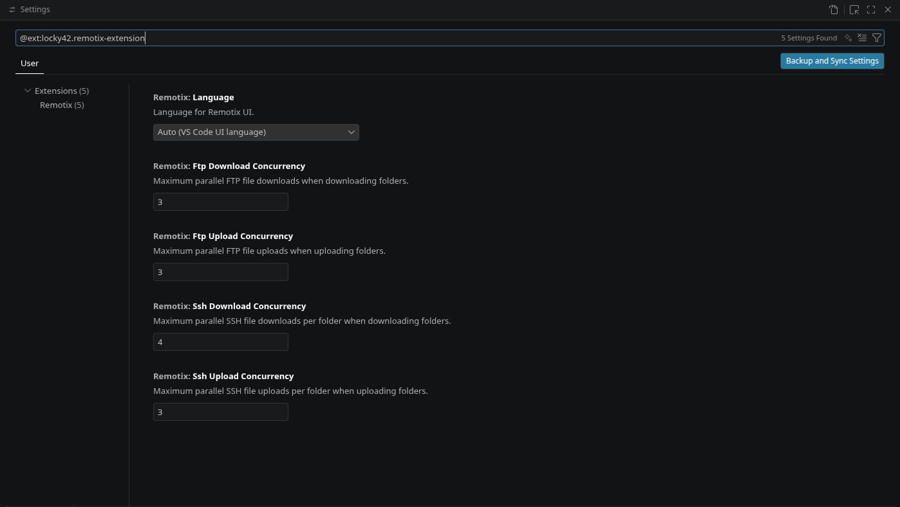

# Remotix 🚀

**Remotix** is a powerful VS Code extension for managing remote servers via **SSH and FTP**, directly from the sidebar.

Control your infrastructure, edit files, and manage remote systems without leaving your editor.

---

## 🔥 What's New in v1.3.1

- **📦 Download as Archive**: Download remote folders and files as a zip archive in one click.
- **🚨 Connection Error Notifications**: SSH/FTP connection failures now show descriptive error messages.

Previous: v1.3.0

- **🛡️ Secret Storage Migration**: Industry-standard encryption for your passwords.
- **↕️ Manual Connection Sorting**: Reorder servers via drag-and-drop.
- **🔐 Permission Management (chmod)**: Full control over file/folder permissions.
- **📄 Properties Dialog**: View detailed metadata (owner, group, timestamps).
- **🔑 Password Access**: Securely view or copy stored credentials from the UI.

---

## 🔒 Security

Remotix has undergone a major security overhaul in **v1.3.0** to ensure your credentials are handled with professional-grade protection. We have fully migrated to the **VS Code Secret Storage API**.

### 🛡️ OS-Level Encryption
Your passwords are no longer stored in plain-text config files. Instead, they are encrypted and kept in your system's native secure vault:
- **macOS:** Keychain Access
- **Windows:** Credential Manager
- **Linux:** Secret Service (via libsecret)

### 🔄 Automatic Migration
The transition is seamless. Upon updating, Remotix will **automatically move** your existing passwords to the secure storage the first time you connect to each server. No manual re-entry or reconfiguration is required.

### 🔐 Controlled Access
Only the extension itself can securely retrieve these secrets when establishing a connection, and you can securely view or copy your stored passwords directly from the UI if needed.

---

## ✨ Key Features

- **♾️ Unlimited Sessions** — Open and work with multiple SSH and FTP connections simultaneously.
- **📂 Flexible Scope** — Save connections **Globally** or keep them **Project-specific** (tied to your workspace).
- **🛡️ Secure Storage** — Full migration to VS Code Secret Storage API (no more plain-text passwords).
- **↕️ Manual Sorting** — Organize your servers exactly how you want via drag-and-drop.
- **✏️ Live Editing** — Edit remote files with instant synchronization on save.
- **🖥️ Integrated Terminal** — Quick access to SSH terminal sessions directly from the sidebar.
- **🔐 Permission Control** — Manage `chmod` and view file metadata/properties in a clean dialog.
- **📥 One-Click Import** — Seamlessly migrate hosts from `~/.ssh/config` and FileZilla.
- **🌍 Multi-language** — Full native support for English and Ukrainian.

---

## 💎 Why Remotix?

* **🚀 Unified Workflow** — Stop switching between external apps like FileZilla or WinSCP. Browse, edit, and manage your remote infrastructure without ever leaving your editor tabs.
* **🛡️ Invisible Security** — Your credentials are safe. By leveraging the **VS Code Secret Storage API**, Remotix keeps your passwords in your system's secure vault (Keychain/Credential Manager), never in plain-text configs.
* **⚡ Native Performance** — Built specifically for VS Code. Experience smooth tree rendering, smart breadcrumbs, and multi-threaded transfers that scale with your hardware.
* **📂 Full File Control** — Go beyond simple uploads. Manage **permissions (chmod)**, view detailed **metadata**, and use a built-in **SSH terminal** for advanced tasks.
* **📥 Instant Onboarding** — Don't start from scratch. Import your entire server list from `~/.ssh/config` or your existing **FileZilla** profiles in one click.
* **🏗️ Scalable Infrastructure** — Manage complex environments easily. Keep your project-specific servers tied to their repositories while having your main dev servers accessible globally.
* **⚡ True Multi-tasking** — Remotix doesn't limit you to one active session. Monitor logs on one server while editing files on another and uploading assets to a third — all at the same time.

---

## 🧭 How to Use

1. **Open Remotix**: Click the Remotix icon in the VS Code Activity Bar (sidebar).
2. **Add Connections**: Click **"Add Connection"** or use the **"More Actions"** menu to import hosts from SSH config or FileZilla.
   > **💡 Pro Tip:** You can choose to save each connection **Globally** (available in any VS Code window) or **Project-specific** (tied only to your current workspace).
3. **Browse Files**: Expand any server in the list to explore remote directories in a familiar tree view.
4. **Manage Items**: Use the context menu (right-click) to upload, download, edit, rename, or delete files and folders.
5. **Open Terminal**: Launch a secure SSH terminal session directly from the server item in the list.
6. **Customize**: Access extension settings via the **Gear Icon (⚙️)** at the top of the panel.

---

## ⚙️ Configuration

Remotix is designed to be easily customized via the VS Code Settings UI.

### 🛠️ Quick Access
You can open the settings page directly by clicking the **Gear Icon (⚙️)** at the top of the Remotix sidebar panel.

Alternatively:
1. Press `Ctrl + ,` (or `Cmd + ,` on macOS).
2. Search for `@ext:locky42.remotix-extension`.

### 🎛️ Available Options

| Setting | Description | Default |
| :--- | :--- | :--- |
| **Language** | Choose between `auto`, `English`, or `Ukrainian` UI. | `auto` |
| **FTP Concurrency** | Max parallel FTP file workers for faster transfers. | `3` |
| **SSH Concurrency** | Max parallel SSH file workers per folder. | `3` |

> [!TIP]
> **Performance:** If you are working with a high-speed connection and many small files, try increasing the **Concurrency** values to `5` or `10` to significantly speed up uploads and downloads.

---

## 📸 Screenshots

### 🖥️ Panel & Operations

  

    <strong>Panel Overview</strong> 
    Manage multiple connections in a unified sidebar. Use the <b>Gear Icon</b> for settings or <b>Drag-and-Drop</b> to reorder.
    
  

  

    <strong>File Operations</strong> 
    Manage your remote file system with a native-feel context menu. Change <b>Permissions (chmod)</b> or view metadata.
    
  

---

### ✏️ Remote File Editing
Open remote files directly in VS Code with syntax highlighting and instant sync on save. Treat your remote server as a local workspace.

  

---

### 🖥️ Integrated SSH Terminal
Launch secure terminal sessions with one click. Execute commands and monitor your server without switching to an external terminal.

  

---

### 📄 Detailed Metadata
The **Properties Dialog** gives you full visibility into remote file attributes, including ownership, exact timestamps, and UID/GID.

  

---

### ⚙️ Deep Customization
Fine-tune your experience via VS Code settings. Adjust concurrency for faster transfers or change UI language.

  

---

## 📖 The Story Behind Remotix

**Remotix was born out of pure frustration.**

While working on **Linux Mint**, I found that existing FTP/SSH clients were either clunky, unstable, or simply felt like they belonged in the early 2000s. I didn't want a heavy standalone app like FileZilla — I wanted a tool that treats remote servers with the same respect as local folders, right inside my editor.

### The Evolution
What started as a practical replacement for unstable tools has grown into a professional workflow. The mission was to create something that **just works** — no crashes during large transfers, no fragmented UI, just a clean integration with VS Code.

With the **v1.3.0 release**, Remotix has reached a new level of maturity. By migrating from plain-text configurations to the **VS Code Secret Storage API**, the project has evolved from a personal helper into a robust, secure extension built for professional environments.

Remotix is my daily driver, and I’m committed to keeping it the most straightforward and secure way to manage your servers.

---

## 📝 License

MIT License — free to use, modify, and distribute.

---

## 🚀 Summary

Remotix brings fast, secure, and seamless remote server management directly into VS Code — without leaving your editor.